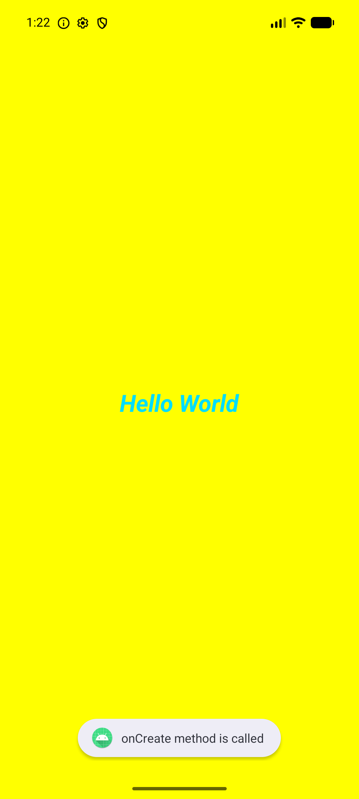
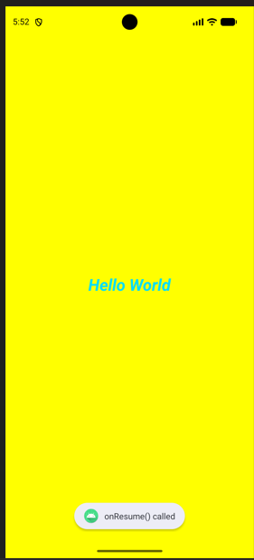
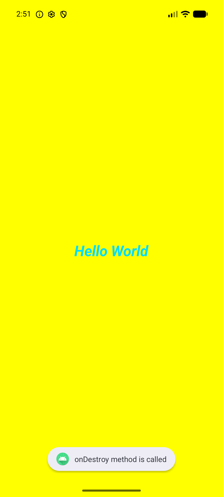
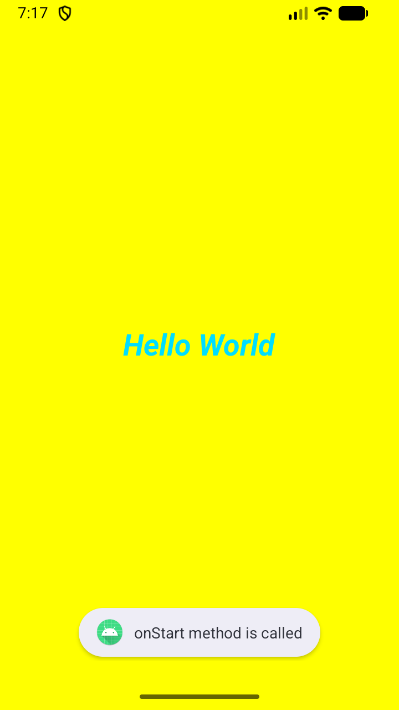
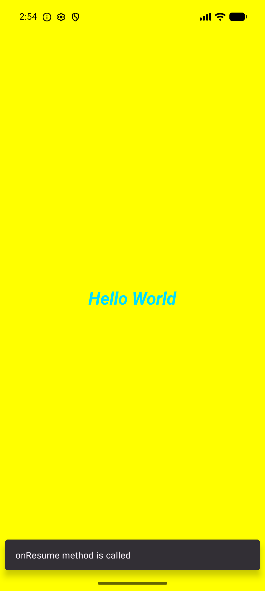

# Practical-2: Activity Life Cycle & Basic UI

## AIM & Objective
Create an Android Application to demonstrate **Activity Life Cycle** functions (`onCreate`, `onStart`, etc.) and **Basic UI** styling. Observe transitions using **Logcat**, **Toast**, and **Snackbar**.

---

### 2. Toast Message Simulation
| onCreate | onResume | onDestroy |
| :---: | :---: | :---: |
|  |  |  |

### 3. Snackbar Message Simulation
| onStart | onResume | onrestart |
| :---: | :---: | :---: |
|  |  |  |

---

## UI Implementation Details
- **Layout:** `ConstraintLayout` with Yellow Background (`#FFFF00`).
- **TextView:** "Hello World" centered.
- **Styling:** Holo Blue Bright, 27sp, **_Bold & Italic_**.

## Lifecycle Logic (`MainActivity.kt`)
```kotlin
private fun display(msg: String) {
    Log.i("MainActivity", msg) // Logcat
    Toast.makeText(this, msg, Toast.LENGTH_SHORT).show() // Toast
    Snackbar.make(findViewById(R.id.main), msg, Snackbar.LENGTH_SHORT).show() // Snackbar
}
```

---
**Enrollment No:** 24012011117  
**Practical:** 02
