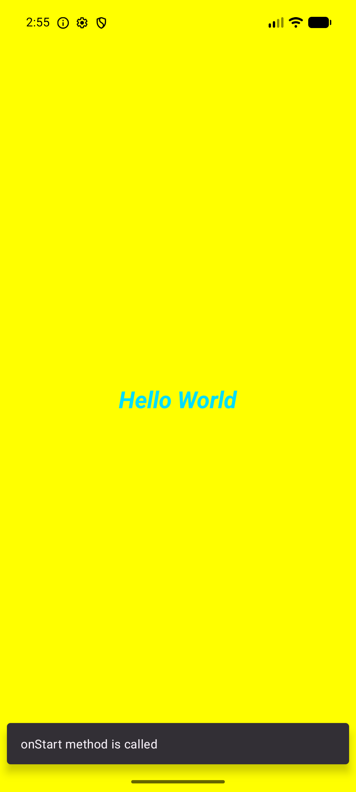
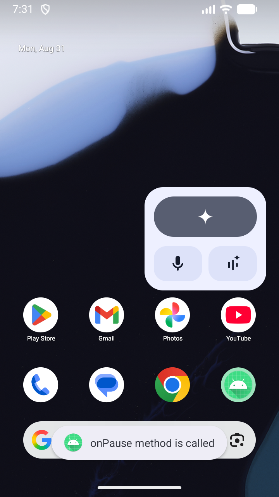

# Practical-2: Activity Life Cycle & Basic UI

## AIM & Objective
Create an Android Application to demonstrate **Activity Life Cycle** functions (`onCreate`, `onStart`, etc.) and **Basic UI** styling. Observe transitions using **Logcat**, **Toast**, and **Snackbar**.

---

### 2. Toast Message Simulation
| onCreate | onResume | onDestroy |
| :---: | :---: | :---: |
|  |  |  |

### 3. Snackbar Message Simulation
| onStart | onResume | onrestart |
| :---: | :---: | :---: |
|  |  |  |

| onPause |
| :---: | 
|  |
---

## 🎯 Objectives

1. Create a basic Android Activity.
2. Display text using a `TextView`.
3. Customize the properties of the `TextView`.
4. Understand and implement the Android Activity Life Cycle.
5. Display Activity Life Cycle methods in **Logcat**.
6. Display messages using **Toast**.
7. Display messages using **Snackbar**.
8. Understand Android built-in resources such as colors.
9. Understand basic `ConstraintLayout` properties.
10. Generate and use an ID for a `TextView`.

---

## 🛠️ Technologies Used

| Technology | Description |
|---|---|
| Android Studio | Development Environment |
| Android | Application Platform |
| Java / Kotlin | Programming Language |
| XML | User Interface Design |
| ConstraintLayout | Layout |
| TextView | Displays text |
| Logcat | Displays Log messages |
| Toast | Displays short messages |
| Snackbar | Displays temporary messages |

---

## UI Implementation Details
- **Layout:** `ConstraintLayout` with Yellow Background (`#FFFF00`).
- **TextView:** "Hello World" centered.
- **Styling:** Holo Blue Bright, 27sp, **_Bold & Italic_**.

## Lifecycle Logic (`MainActivity.kt`)
```kotlin
private fun display(msg: String) {
    Log.i("MainActivity", msg) // Logcat
    Toast.makeText(this, msg, Toast.LENGTH_SHORT).show() // Toast
    Snackbar.make(findViewById(R.id.main), msg, Snackbar.LENGTH_SHORT).show() // Snackbar
}
```

---
**Enrollment No:** 24012011117  
**Practical:** 02
